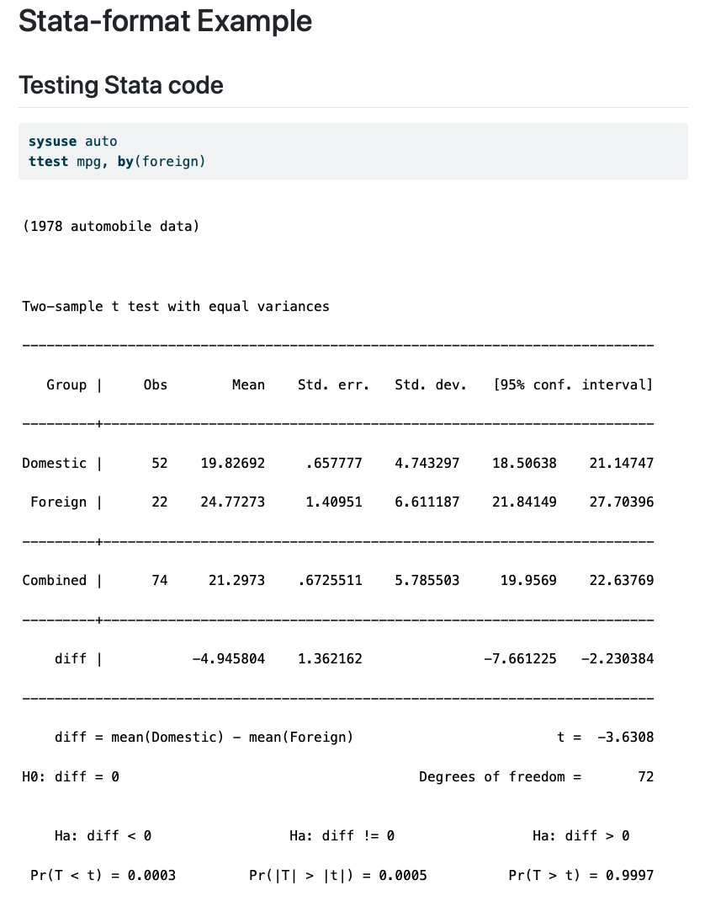
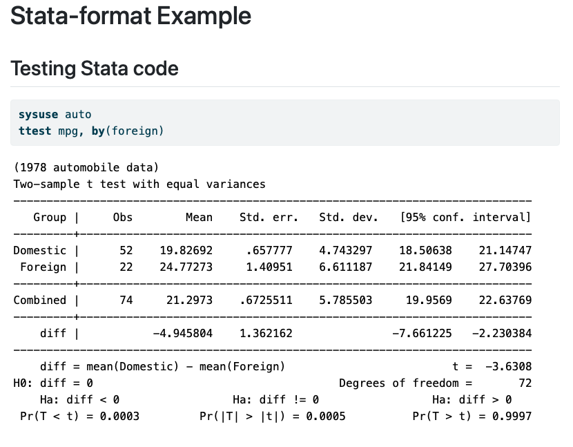

# Stata-format Extension For Quarto

Formats output from [stata_kernel](https://github.com/kylebarron/stata_kernel) in Quarto.
While `stata_kernel` enables Stata to run natively in Quarto (via Jupyter) by inserting
code cells such as this:

````
```{stata}
exit, clear
```
````

the fact that the kernel returns messages as a stream means that Quarto creates a separate
`div` element for each line of output, resulting in many unnecessary newlines that make the
output hard to read. This extension combines all consecutive text outputs into a single
`div` and removes all redundant newlines.

## Installing

```bash
quarto add jbshannon/stata-format
```

This will install the extension under the `_extensions` subdirectory.
If you're using version control, you will want to check in this directory.

## Using

To use the extension in a document, simply include this in the YAML header:

```
---
filters:
  - jbshannon/stata-format
---
```

## Example

Here is the source code for a minimal example: [example.qmd](example.qmd).

Without running the extension, this is how the document renders:



With the extension, the output becomes:



